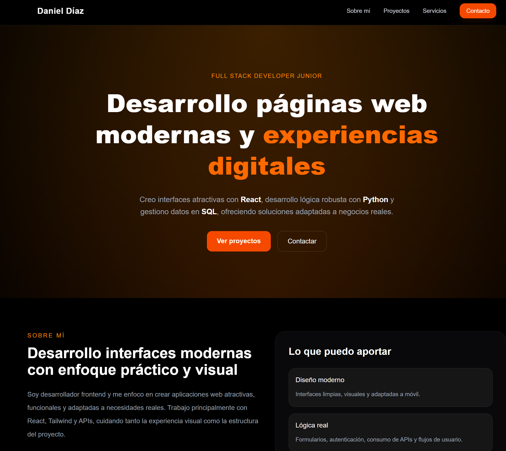

# 🚀 My Personal Portfolio - Daniel David Díaz Flores

Hi there! I'm **Daniel David Díaz Flores**, a **Full Stack Developer** passionate about creating amazing web experiences. Here you will find the source code for my portfolio and the projects I've built.

## 🔗 Quick Links
- **Live Demo:** [danieldaviddf.vercel.app](https://danieldaviddf.vercel.app/)
- **GitHub Profile:** [github.com/Danieldaviddf](https://github.com/Danieldaviddf)

## 🛠️ Tech Stack
For this project, I used:
*   **Frontend:** React.js / Next.js / HTML5 & CSS3
*   **Styling:** Tailwind CSS / Styled Components
*   **Deployment:** Vercel / Netlify

## ✨ Key Features
- **Responsive Design:** Fully optimized for mobile, tablets, and desktop devices.
- **Modern UI:** Clean and intuitive user interface.

## 📸 Preview


## 🏗️ Local Installation
If you want to explore the code locally, follow these steps:

1.  **Clone the repo:**
    ```bash
    git clone https://github.com/Danieldaviddf/Portafolio
    ```
2.  **Install dependencies:**
    ```bash
    npm install
    ```
3.  **Run the project:**
    ```bash
    npm run dev
    ```

---
Made with ☕ and 💻 by **Daniel Díaz**.
